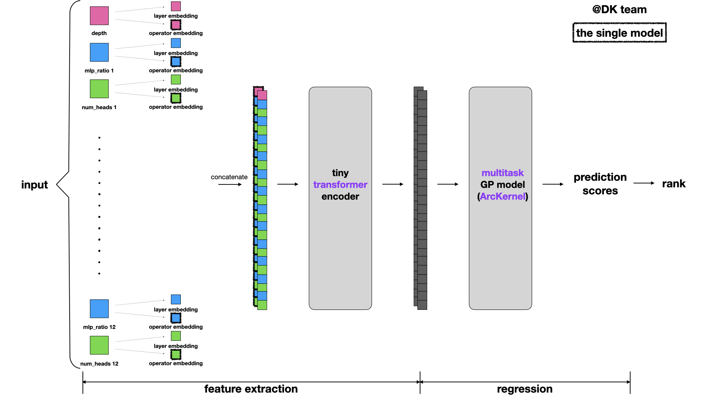
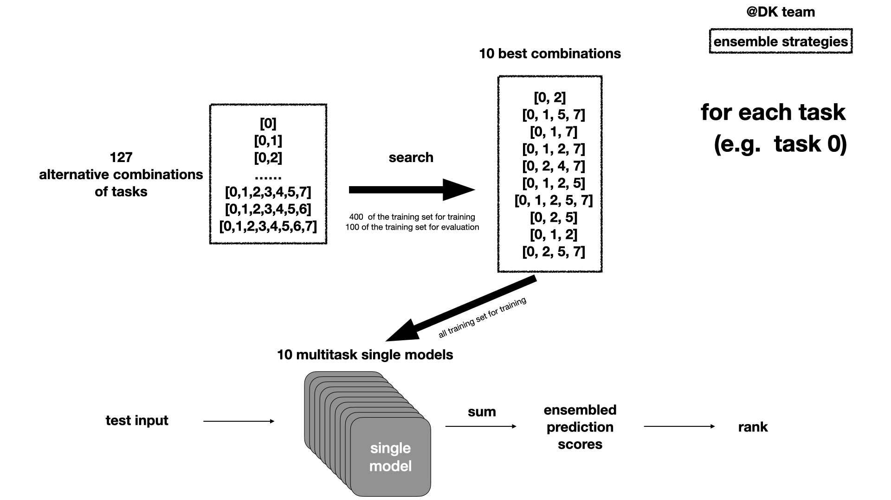

# DK

(DK) Solution of 2022-CVPR-track2-Performance-Estimation (11th)

Table of Contents
- [about_team](#about_team)
- [our_work](#our_work)
- [Getting_Start](#Getting_Start)

## about_team
- [xuefei4545](https://github.com/xuefei4545)
- [bql](https://github.com/bql)
- [betterest](https://github.com/bebetterest)

## our_work

### single_model_structure

key points in the picture of our single model structure:
- transformer-style embedding
- tiny transformer encoder
- multitask gaussian process model
- ArcKernel

### ensemble_structure

key points in the picture of our ensemble structure:
- multitask-based ensemble
- search-based selection

## Getting_Start

run [search _multitasks_cp.ipynb](https://github.com/bebetterest/DK-Solution-of-2022-CVPR-track2-Performance-Estimation/blob/main/search%20_multitasks_cp.ipynb) to get the search result file (search_res.json) for ensemble.

run [ensemble_transformer_multitasksGP.ipynb](https://github.com/bebetterest/DK-Solution-of-2022-CVPR-track2-Performance-Estimation/blob/main/ensemble_transformer_multitasksGP.ipynb) to get the ensemble result.
