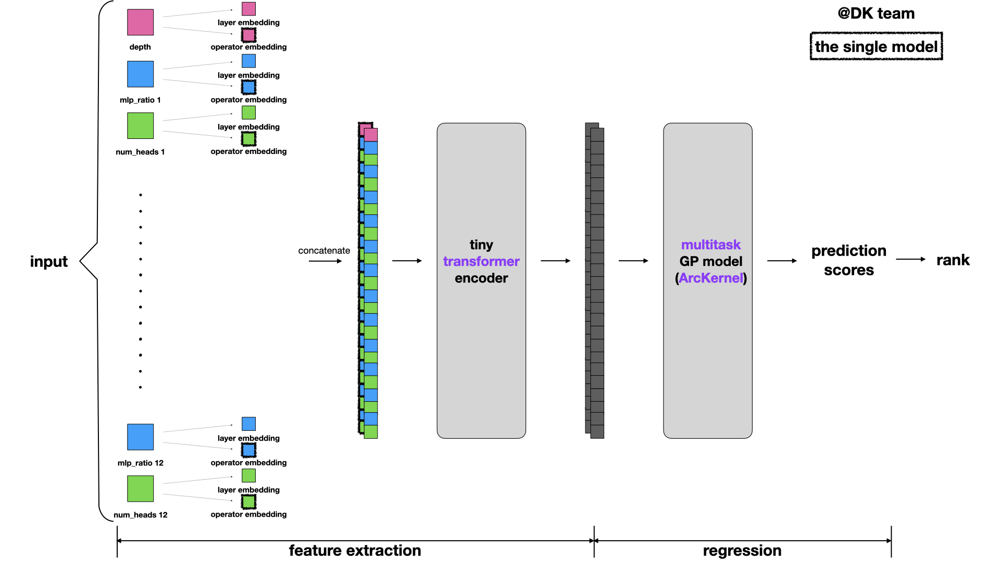
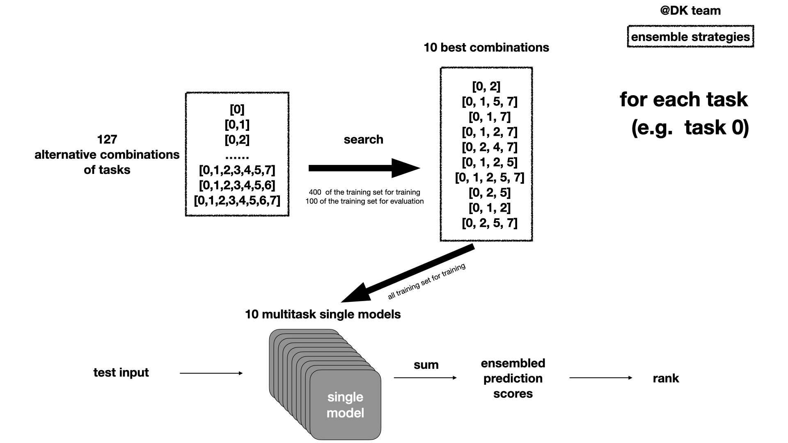

# DK

## Table of Contents
- [our_work](#our_work)
- [Getting_Start](#Getting_Start)

## our_work

### single_model_structure

- transformer-style embedding
- tiny transformer encoder
- multitaskGP
- ArcKernel

### ensemble_structure

- search-based selection of combinations of tasks

## Getting_Start

run search _multitasks_cp.ipynb to get the search result file (search_res.json) for ensemble.

run ensemble_transformer_multitasksGP.ipynb to get the ensemble result.
